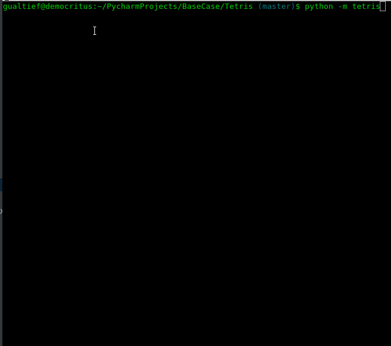

# Tetris

## Table of Contents

### Overview
### Design
### Dependencies
### Running Tests
### Running the App
### Installing the App

## Overview

This is a text-mode [Tetris](https://en.wikipedia.org/wiki/Tetris) game implementation in Python following the [included specifications](specification/ProgrammingTestTetris.pdf).

It's my understanding that the specs are missing one action: move down.

Given the actions listed in the specs:

* a (return): move piece left
* d (return): move piece right
* w (return): rotate piece counter clockwise
* s (return): rotate piece clockwise

And also the following sentence, also from the same specs:

>
> Note that the game only updates after the user has entered a valid action.
>

That would result in pieces only moving diagonally (to the left or to the right) or moving down while being rotated. For that reason, I have added a move down action.

I also added an exit action (exit the game).

Note that the specification also states that each action is followed by the return key.

I felt that this kills the dynamic of the game... It wouldn't feel like Tetris this way, thus, in this implementation, the return key is not required.

Updating the specs with these changes, the new list of actions is:

* a: move piece left
* d: move piece right
* w: rotate piece counter clockwise
* s: rotate piece clockwise
* x: move piece down
* e: exit

## Design

The following class diagram is the result of TDD design. Rather than starting the coding process after having the class diagram prior, the following class diagram is the final result of an iterative process.

<!---
custom_mark1
    /**
     *@opt all
     *@composed 1 Has 2 Board
     */
    class Game {
        public void current_state();
        public void move_piece_left();
        public void move_piece_right();
        public void rotate_piece_left();
        public void rotate_piece_right();
        public void move_piece_down();
    }
    /**
    *@opt all
    *@composed 1 Has 1 Piece
    */
    class Board {
        public void render();
        public void place_piece(piece);
    }
    /**
    *@opt all
    */
    class Piece {
        Piece(String shape, Tuple coordinates);
        public void rotate_right();
        public void rotate_left();
        public void move_right();
        public void move_left();
        public void move_down();
        public void rollback();
    }
custom_mark1
-->

## Dependencies

This app has been developed with Python version 2.7 and the following packages:

* Nose 1.3.7 (for tests)
* Numpy 1.11.0 (for matrix rotation)

## Running Tests

To run the test suite, execute the following command:

    nosetests -vv

You should get the following output:

    nose.config: INFO: Ignoring files matching ['^\\.', '^_', '^setup\\.py$']
    test_create_empty_board (entities.test_board.TestBoard) ... ok
    test_place_piece_in_invalid_position (entities.test_board.TestBoard) ... ok
    test_place_piece_in_valid_position (entities.test_board.TestBoard) ... ok
    test_move_piece_left (entities.test_game.TestGame) ... ok
    test_move_piece_right (entities.test_game.TestGame) ... ok
    test_new_game (entities.test_game.TestGame) ... ok
    test_rotate_piece_left (entities.test_game.TestGame) ... ok
    test_rotate_piece_right (entities.test_game.TestGame) ... ok
    test_crank_piece (entities.test_piece.TestPiece) ... ok
    test_create_piece (entities.test_piece.TestPiece) ... ok
    test_l_piece (entities.test_piece.TestPiece) ... ok
    test_move_piece_down (entities.test_piece.TestPiece) ... ok
    test_move_piece_left (entities.test_piece.TestPiece) ... ok
    test_move_piece_right (entities.test_piece.TestPiece) ... ok
    test_reverse_l_piece (entities.test_piece.TestPiece) ... ok
    test_rotate_piece_left (entities.test_piece.TestPiece) ... ok
    test_rotate_piece_right (entities.test_piece.TestPiece) ... ok
    test_square_piece (entities.test_piece.TestPiece) ... ok
    test_stick_piece (entities.test_piece.TestPiece) ... ok

    ----------------------------------------------------------------------
    Ran 19 tests in 0.129s

    OK

## Running the App

From the project folder, type the following command:

    python -m tetris

## Installing the App

That's not required, but the app may be installed by typing the following command:

    sudo python ./setup.py install